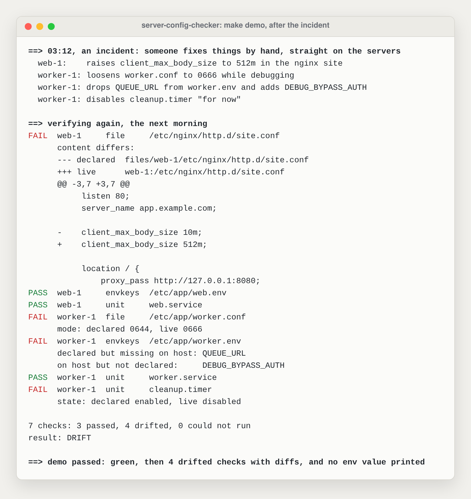
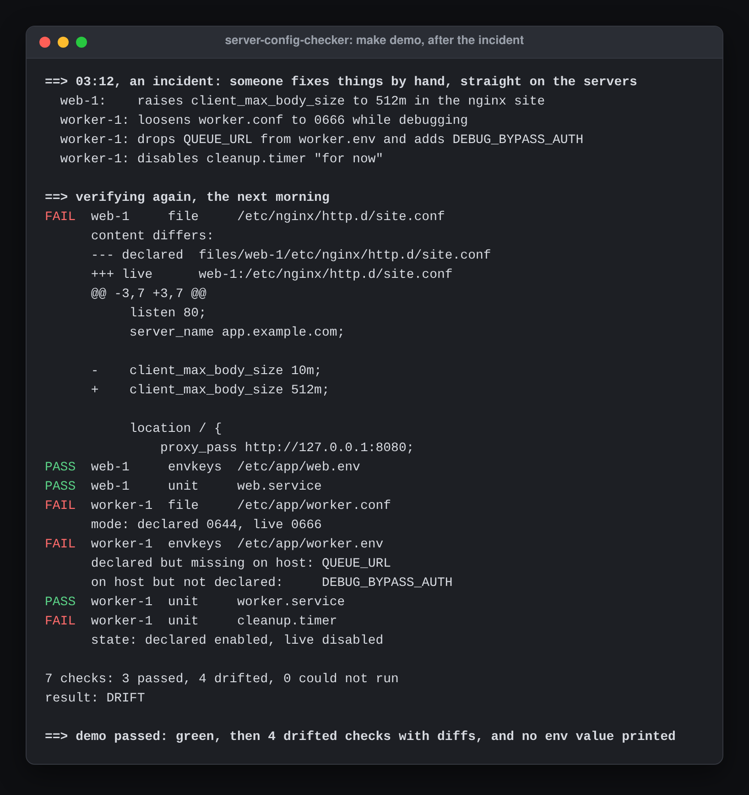
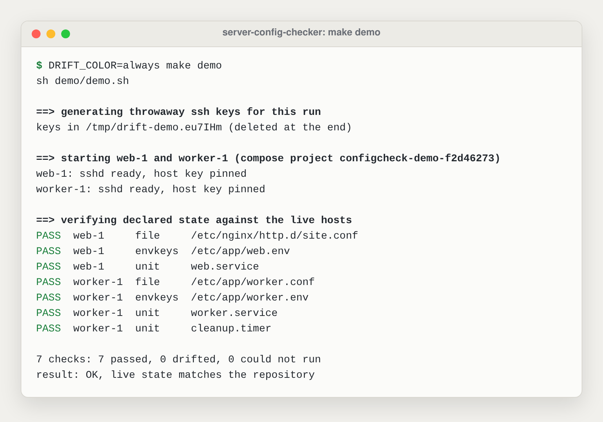

# server-config-checker

[](https://github.com/eranoix/server-config-checker/actions/workflows/ci.yml) [](LICENSE)  

**Checks that servers are still set up the way they should be, and shows exactly what changed.**

*In plain words:* When you look after several servers, their settings slowly drift away from what was planned, often without anyone noticing. This tool compares how each server should be set up with how it actually is. It lists every difference, down to the exact line in a file, and it never changes anything on the servers itself. It is for people who run servers and want to catch surprises before they cause trouble.

A small, read-only verifier that compares the configuration you declared in a
repository with what is actually on your servers, over plain SSH. POSIX shell,
no agent on the hosts, nothing to install on them.

After someone edits two servers by hand, the demo (`make demo`) reports exactly
what changed:

<p align="center"> </p>

## Why I built it

Every setup I have worked on had some config that lived outside any repo. An
nginx site edited in place during an incident. A systemd unit someone
disabled "for now". An env file with one more key than it should have, added
over SSH at a bad hour and never written down.

None of that breaks anything on the day it happens. It drifts silently, and
it shows up weeks later, usually at another bad hour, as "but it works on the
other server" or "who turned that off?". By then nobody remembers the change,
and the repository that is supposed to describe the machines is quietly
lying.

I wanted something small that answers one question honestly: does what is
running still match what we wrote down? And I wanted to trust the answer,
which is why most of this project is tests.

## What it does

You declare state in the repository. The verifier connects to each host over
SSH, reads, and compares. It never writes to a host.

Three kinds of checks:

| kind      | declared as                                   | compares                                          |
|-----------|-----------------------------------------------|---------------------------------------------------|
| `file`    | `files/HOST/etc/app/app.conf` plus a mode     | content (shown as a unified diff) and permissions |
| `unit`    | `units/HOST/name.service` plus enabled/disabled | the unit file and whether it is enabled         |
| `envkeys` | `envkeys/HOST/etc/app/app.env.keys`           | the set of KEY NAMES only, never the values       |

Alongside the verifier there are two small tools for when several people (or
several jobs) change the declared state at the same time:

- `bin/drift-lock`: a named lock with timeouts and stale-lock recovery.
- `bin/drift-queue`: a first come, first merged queue that merges one change
  at a time and only keeps it if the gate (`make check`) passes.

## Try it

You need Docker with the compose plugin, `ssh-keygen` and `make`.

```sh
make demo
```

The demo:

1. generates throwaway SSH keys for this run only (client key and one host key
   per server, so the verifier runs with strict host key checking);
2. starts two fake servers, `web-1` and `worker-1`, each with sshd and a
   fixture file system;
3. runs the verifier: everything matches, exit 0;
4. simulates an incident: someone edits the nginx site, loosens a file mode,
   swaps an env key and disables a timer, by hand, on the servers;
5. runs the verifier again: 4 checks drift, with diffs, exit 1;
6. removes everything it created (containers, network, built images, keys).

The first verification, before the incident, is all green:

<picture><source media="(prefers-color-scheme: dark)" srcset="docs/screenshots/02-clean-run-dark.png"></picture>

The report is coloured when it goes to a terminal; `DRIFT_COLOR=always make demo`
keeps the colours inside the demo's containers too.

The demo fails if step 3 is not green, if step 5 is not red, or if any env
value shows up anywhere in its output. It uses a unique compose project name
per run, so it never touches other containers on your machine.

To run the offline test suite (no network, no Docker; the lint step needs
[ShellCheck](https://www.shellcheck.net), for example `apt install shellcheck`):

```sh
make check      # shellcheck + tests
```

## Sample output

After the "incident" in the demo:

```
FAIL  web-1     file     /etc/nginx/http.d/site.conf
      content differs:
      --- declared  files/web-1/etc/nginx/http.d/site.conf
      +++ live      web-1:/etc/nginx/http.d/site.conf
      @@ -3,7 +3,7 @@
           listen 80;
           server_name app.example.com;

      -    client_max_body_size 10m;
      +    client_max_body_size 512m;

           location / {
               proxy_pass http://127.0.0.1:8080;
PASS  web-1     envkeys  /etc/app/web.env
PASS  web-1     unit     web.service
FAIL  worker-1  file     /etc/app/worker.conf
      mode: declared 0644, live 0666
FAIL  worker-1  envkeys  /etc/app/worker.env
      declared but missing on host: QUEUE_URL
      on host but not declared:     DEBUG_BYPASS_AUTH
PASS  worker-1  unit     worker.service
FAIL  worker-1  unit     cleanup.timer
      state: declared enabled, live disabled

7 checks: 3 passed, 4 drifted, 0 could not run
result: DRIFT
```

Note what the env check says and what it does not: it names the key that
appeared (`DEBUG_BYPASS_AUTH`), and there is no way for it to print what that
key was set to.

Exit codes: `0` no drift, `1` drift found, `2` a check could not run (or a
usage error). An unreachable host is never a pass: the run is marked
`INCOMPLETE` and exits 2.

## Design principles

**Read-only, always.** Each check sends a short script over
`ssh host sh -s` and reads its output. The scripts only `stat`, `cat` and list
directories. Enablement of a unit is read from the `*.wants/` symlinks that
`systemctl enable` creates, not by calling `systemctl`, which also means it
works where systemd is not running. The demo authorizes the verifier's key
with `restrict` for an unprivileged user. A test runs the verifier over a
fixture tree and checks that not one byte, mode or timestamp changed.

**Values are never printed.** Env files are compared by key name only, and
the value is dropped on the host, before anything is written to stdout, so it
never even crosses the SSH connection. The `file` check refuses anything that
looks like an env or key file and tells you to use `envkeys` instead, because a
content diff is exactly where a secret would end up in a CI log. Remote stderr
is never echoed for env checks. A test plants a random sentinel as a value in
every shape the parser knows (plain, `export`, quoted, multi-line with a
continuation line that looks like `KEY=value`) and a few it does not, runs the
passing, failing and error paths, and asserts the sentinel appears zero times.

**A check without a failing test doesn't count.** Every check kind has
negative tests that start from a green fixture, break the target (edit a
line, loosen a mode, delete a file, disable a unit, drop a key) and prove the
verifier now exits 1 with the right message. The suite keeps a ledger of the
negative cases that passed, and `tests/coverage.sh` fails the run if any file
in `lib/checks/` has none. That rule is itself tested: a check that always
passes, or one with an empty test file, makes the suite fail.

**Fail closed.** An unknown check kind, a host missing from the inventory, a
path with `..` or shell metacharacters, an SSH failure: all of these are
errors, never passes. Names from the declared state are validated against a
closed character set before they reach a command line.

**Boring tools.** POSIX sh, awk, sed, diff and ssh. The demo runs the verifier
inside a busybox container on purpose, and CI runs the tests under both dash
and busybox sh.

## Layout

```
bin/config-check        the verifier
bin/drift-lock          named lock
bin/drift-queue         merge queue
lib/common.sh           validation, inventory, SSH transport
lib/checks/*.sh         one file per check kind (runs locally, compares)
lib/remote/*.sh         the read-only half that runs on the host
locks.conf              the closed list of lock names
tests/                  offline suite, negative tests, coverage gate
demo/                   compose demo: two hosts, a control node, declared state
```

The verifier is `bin/config-check`. The two helper scripts, and the `DRIFT_`
environment variables, keep the project's original `drift` prefix.

Declared state:

```
state/
  inventory.tsv         name  transport  address      (web-1  ssh  ops@web-1.example.com:22)
  checks.tsv            host  kind  target  expect     (web-1  file /etc/app/app.conf 0644)
  files/HOST/<abs path>
  units/HOST/<unit>
  envkeys/HOST/<abs path>.keys
```

SSH settings come from the environment: `DRIFT_SSH_KEY`,
`DRIFT_KNOWN_HOSTS` (enables strict host key checking), `DRIFT_SSH_OPTS`,
`DRIFT_SSH_TIMEOUT`. Anything else comes from your normal `~/.ssh/config`.

## The lock and the queue

Once more than one person edits the declared state, two things go wrong:
two changes race each other, and the "fix" for one quietly undoes the other.

`drift-lock NAME -- command` runs a command inside a named critical section.

- Names come from a closed list (`locks.conf`). A typo would otherwise create a
  brand new lock that excludes nobody and still looks like protection.
- On timeout it exits 2 and does **not** run the command. A lock that gives
  up and runs anyway is worse than no lock.
- Stale locks are recovered only when they were taken on this host and both
  the holder and its command are gone. Killing the holder with `-9` while its
  command still runs does not free the lock. A lock held from another host is
  never taken over automatically.
- Recovery happens under a separate guard, and holders release under the
  same guard, so two waiters can never both "recover" the same lock and one of
  them delete a lock the other just took. The tests race four waiters against
  one stale lock and check the critical sections never overlap.

`drift-queue` builds a merge queue on top of it:

```sh
drift-queue submit fix-nginx-timeouts   # queued #7 fix-nginx-timeouts
drift-queue list
drift-queue run                         # merges in ticket order, gate after each
```

- Ticket numbers are taken under a short lock, so concurrent submitters get
  distinct, increasing numbers. The tests submit eight branches at once and
  check the history shows them merged in exactly ticket order.
- Every merge is `--no-ff`, so `git log --first-parent` is an audit trail of
  what passed the gate and when.
- A red gate or a conflict rejects that ticket and resets the target branch to
  where it was. The next ticket still gets its turn.
- If the machine dies mid-merge, an `inflight` record survives. The next run
  recovers the stale lock, resets to the recorded commit and merges the
  ticket again, properly. The tests do this with `kill -9`.

## Tests

```sh
make lint    # ShellCheck over every script
make test    # the offline suite: no network, no Docker
make check   # both, the same gate the lock and the queue use
```

The suite in `tests/` covers each kind of check (`tests/checks/file.sh`,
`envkeys.sh`, `unit.sh`) and the command line itself (`tests/test_cli.sh`), and
`tests/coverage.sh` fails the run unless every check type has a test file
and at least one negative case that passed in this run. CI runs the suite twice,
under dash and again under busybox sh, so nothing Bash-only slips in. It then
runs `make demo` end to end (green first, then the drift after the simulated
incident) and fails if the demo leaves a container behind.

## Limitations

- PID reuse: a stale lock whose holder PID was reused by an unrelated process
  looks alive and is not recovered until that process ends. The failure mode
  is waiting, never double entry.
- `unit` only looks at `/etc/systemd/system`, where locally managed units
  live. Vendor units under `/usr/lib/systemd` are out of scope on purpose.
- `envkeys` cannot tell you that a value changed. That is the price of never
  reading values, and I think it is the right trade.

## License

MIT, see [LICENSE](LICENSE).
